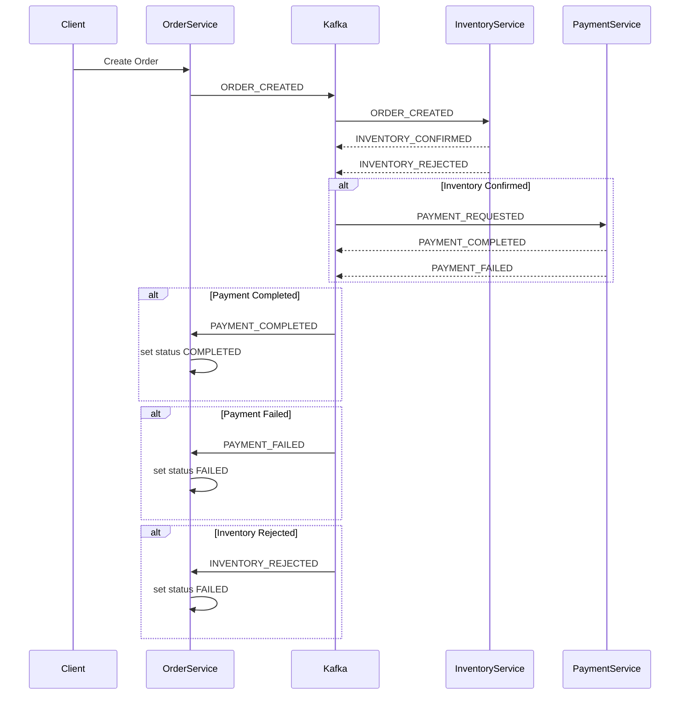
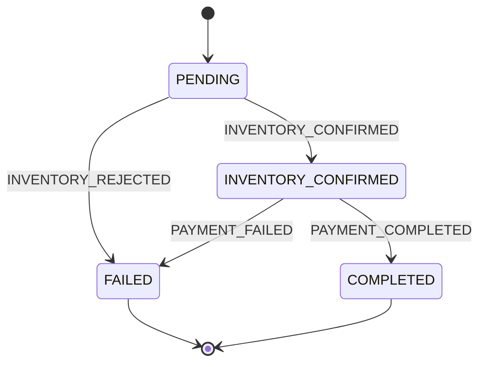

---
# 🧾📦  Order Service (Saga Version)

Order Service is a microservice responsible for managing orders in an e-commerce system.  
This is the **updated Saga version**, replacing the legacy CRUD approach.  
You can find the legacy CRUD version here: [Legacy CRUD Version](https://github.com/Andrij72/order-service/tree/develop_crud)

---

## 📌 Features

- **Order management**: create, update, cancel, and fetch orders.
- **Saga orchestration** using Kafka for reliable business processes:
    - Inventory confirmation
    - Payment processing
- **Outbox pattern** for reliable Kafka event publishing.
- **Validation** via `@Valid` annotations.
- **Custom exceptions** and global handling (`OrderNotFoundException`, `ProductOutOfStockException`, etc.).

---

## ⚙️ Technology Stack

- Java 21
- Spring Boot 3
- Spring Data JPA
- Kafka (Spring Kafka)
- MySQL (Flyway migrations)
- Lombok
- Avro for event serialization

---

## 🛠 Docker

Dockerfile and docker-compose are provided for local development and production deployment.

```bash
# Build Docker image
docker build -t order-service:latest .

# Run locally with docker-compose
docker-compose -f docker-compose.local.yml up
```
---
## 📡 Kafka Integration

The service listens to the following topics:

| Topic               | Description         | Listener Method                            |
|---------------------|---------------------|--------------------------------------------|
| inventory-confirmed | Inventory confirmed | handleInventoryConfirmed(InventoryEvent)   |
| inventory-rejected  | Inventory rejected  | handleInventoryRejected(InventoryEvent)    |
| payment-completed   | Payment completed   | handlePaymentCompleted(String orderNumber) |
| payment-failed      | Payment failed      | handlePaymentFailed(String orderNumber)    |

Events are published using **Outbox**, processed by a Kafka Worker.

---
## 📄 REST API
Base URL: /api/v1/orders

### Create Order
```http
POST /api/v1/orders
Content-Type: application/json

{
"userDetails": {
  "email": "user@example.com",
  "name": "Andrii"
},
"items": [
  { "productId": "123", "quantity": 2 }
]
}
```
**Response**: 201 Created


### Get Order
```http
GET /api/v1/orders/{orderNumber}
```
**Response**: 200 OK

### Get All Orders (pagination + filters)
```http
GET /api/v1/orders?page=0&size=10&sort=createdAt,desc&status=CREATED&email=user@example.com
```

### Update Full Order
```http
PUT /api/v1/orders/{orderNumber}
Content-Type: application/json
```
### Cancel Order
```http
PATCH /api/v1/orders/{orderNumber}/cancel
```

---

## 🗂 Project Structure

```text
  src/main/java/com/akul/microservices/order
  ├─ controller   # REST endpoints
  ├─ application  # DTOs and services
  ├─ domain       # Models, OrderStatus, Exceptions
  ├─ event        # Events (PaymentRequestedEvent)
  ├─ infrastructure
  │   ├─ messaging/kafka  # Kafka Listeners & Topic Resolver
  │   ├─ outbox           # Outbox pattern
  │   ├─ persistence      # JPA repositories
  │   └─ worker           # Outbox Publisher
  └─ resources
  ├─ db/migration     # Flyway SQL migrations
  └─ application*.properties
  ```
---
## 🔄 Saga Flow Diagram (Kafka + Events)



### 🧠 Saga Explanation

The Order Service participates in a **choreography-based Saga** using Kafka events.

- The process starts when an order is created and `ORDER_CREATED` event is published.
- Inventory Service validates and reserves stock:
  - `INVENTORY_CONFIRMED` → continue flow
  - `INVENTORY_REJECTED` → order is marked as FAILED
- If inventory is confirmed, Payment Service processes payment:
  - `PAYMENT_COMPLETED` → order is COMPLETED
  - `PAYMENT_FAILED` → order is FAILED

There are **no distributed transactions**.  
Each service updates its own state based on events, ensuring **eventual consistency**.
---

🔄 State Machine 
## 📊 Order State Machine


---

## 🧪 Testing
* Unit & Integration tests for services and Kafka:
* OrderServiceIntegrationTest
* AvroSerializationTest
Uses in-memory Kafka for local tests.
---
## 🚀 Running Locally

### Start DB and Kafka
```bash
docker-compose -f docker-compose.local.yml up
```

### Run service
```bash
./mvnw spring-boot:run
```

---
### 👨‍💻 Author
_**Andrii Kulynch**_

📅 Version: 3.0(Saga Architecture)